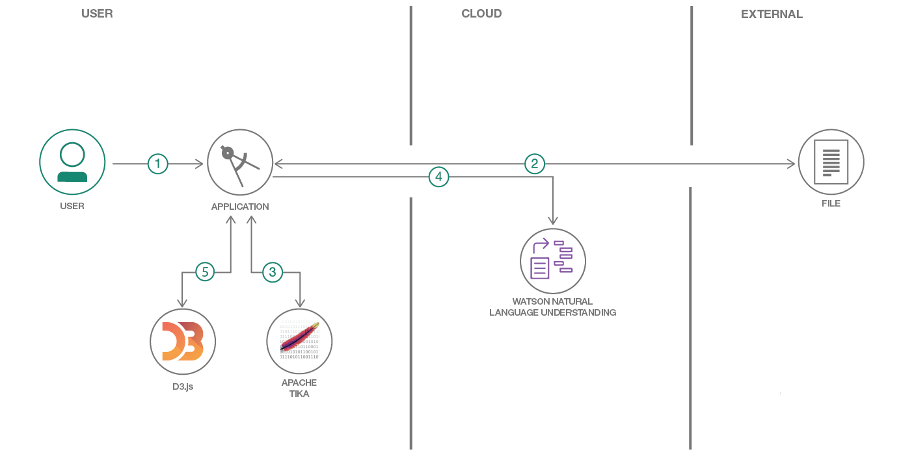
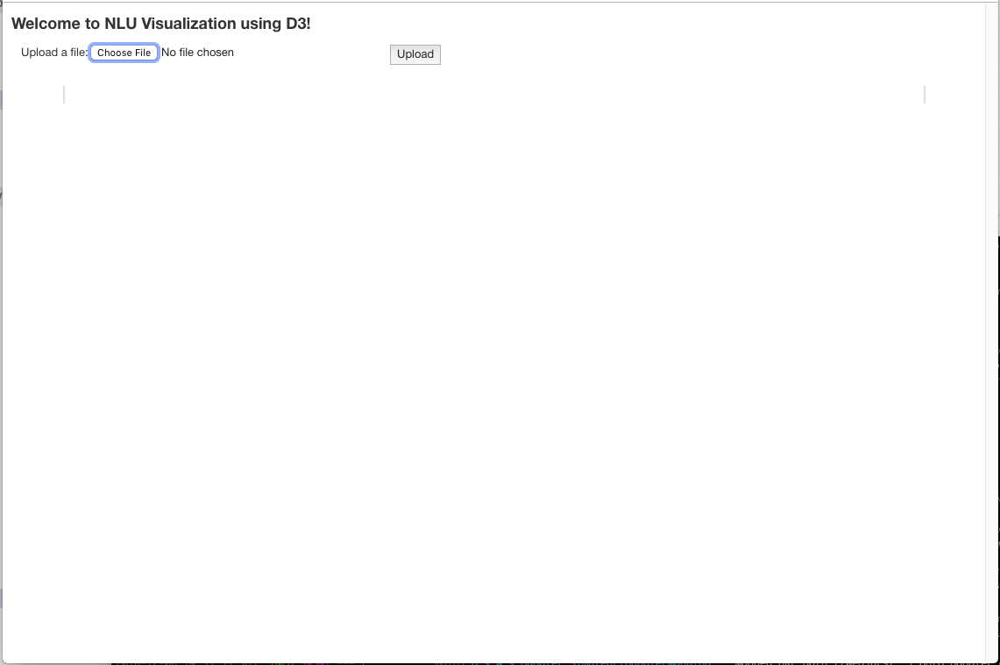
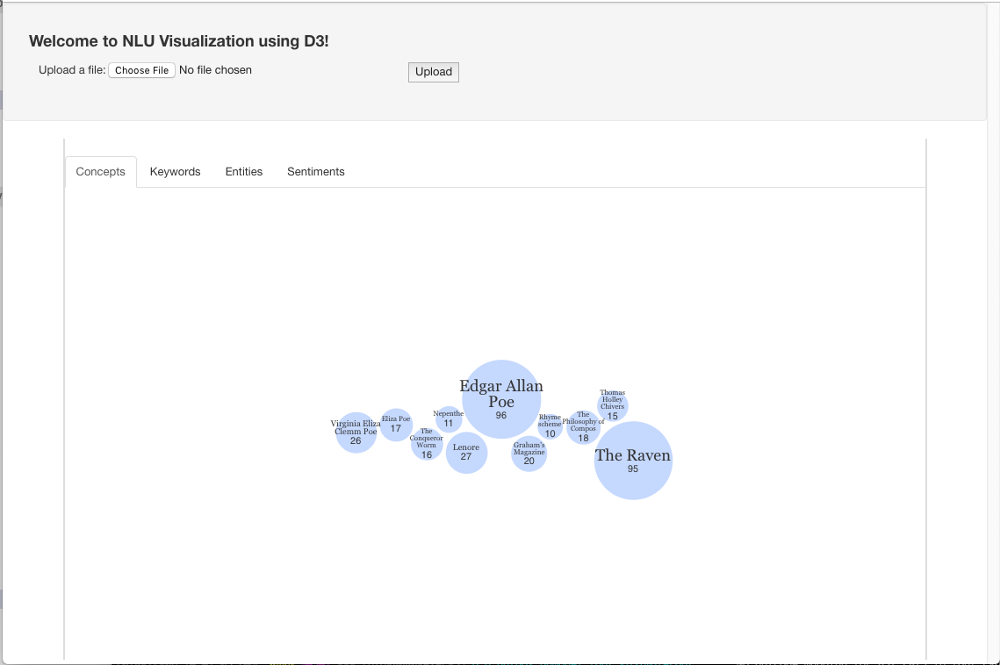
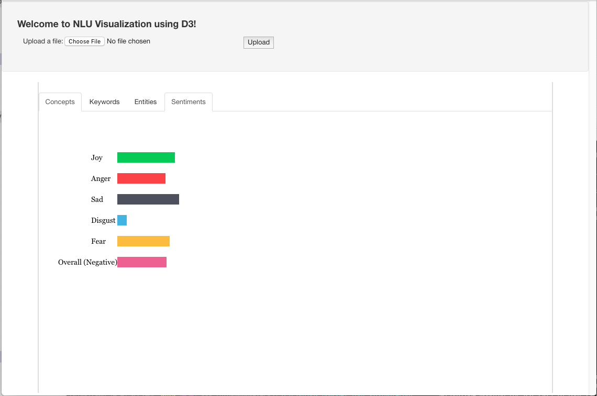

[](https://travis-ci.org/IBM/visualize-unstructured-data-with-watson)

# Visualize Unstructured Data Using Watson Natural Language Understanding

In this Code Pattern, we will create a web app for visualizing unstructured data using Watson Natural Understanding, Apache Tika, and D3.js. After a user uploads a local file of their choosing, the application leverages Apache Tika to extract text from the unstructured data file. The text is then passed through Watson Natural Language Understanding, where entities and concepts are extracted. Finally, the application uses the D3.js library as a visualization tool to display the results to the user.

The main benefit of using the Watson Natural Understanding Service is its powerful analytics engine that provides cognitive enrichments and insights into your data. The key enrichments that are extracted include:

* **Entities**: people, companies, organizations, cities, and more.
* **Keywords**: important topics typically used to index or search the data.
* **Concepts**: identified general concepts that aren't necessarily referenced in the data.
* **Sentiment**: the overall positive or negative sentiment of the data.

The enrichments will be displayed using D3.js, a JavaScript library that provides  powerful visualization techniques that helps bring data to life. In this app, we will use it to display each of the enrichments in an interactive bubble cloud, with each elements size and location determined by its relative significance.

When the reader has completed this Code Pattern, they will understand how to:

* Create and use an instance of Watson Natural Language Understanding
* Leverage Apache Tika to extract text from unstructured files
* Use D3.js for displaying the visuals



## Flow

1. User configures credentials for the Watson NLU service and starts the app.
2. User selects data file to proecess and load.
3. Text is extracted from the data file using Apache Tika.
4. Extracted text is passed to Watson NLU for enrichment.
5. Enriched data is visualized in the UI using the D3.js library.

# Watch the Video

This video is from a webinar produced for the "Building With Watson" series.

[](http://www.youtube.com/watch?v=rqKPQNyl6Xk "")

# Steps

1. [Clone the repo](#1-clone-the-repo)
2. [Create Watson services with IBM Cloud](#2-create-watson-services-with-ibm-cloud)
3. [Configure credentials](#3-configure-credentials)
4. [Run the application](#4-run-the-application)

### 1. Clone the repo

Clone the `visualize-unstructured-data-with-watson` repo locally. In a terminal, run:

```
$ git clone https://github.com/IBM/visualize-unstructured-data-with-watson
```

### 2. Create Watson services with IBM Cloud

Create the following services:

* [**Watson Natural Language Understanding**](https://console.ng.bluemix.net/catalog/services/natural-language-understanding)

### 3. Configure credentials

The credentials for IBM Cloud services, can be found in the ``Services`` menu in IBM Cloud, by selecting the ``Service Credentials`` option for each service.

Use those values to update the `config.properties` file located in the `src/main/resources` directory. Replace the default values with the appropriate credentials (either API key, or username/password). Note that quotes are not required.

```
# Watson Natural Language Understanding
NATURAL_LANGUAGE_UNDERSTANDING_URL=https://gateway.watsonplatform.net/natural-language-understanding/api
## Un-comment and use either username+password or IAM apikey.
NATURAL_LANGUAGE_UNDERSTANDING_IAM_APIKEY=<add_nlu_iam_apikey>
#NATURAL_LANGUAGE_UNDERSTANDING_USERNAME=<add_nlu_username>
#NATURAL_LANGUAGE_UNDERSTANDING_PASSWORD=<add_nlu_password>
```

### 4. Run the application

#### Pre-requisite

Maven >= 3.5 is used to build, test, and run the app. Check your maven version using the following command:

```
mvn -v
```

To download and install maven, click [here](https://maven.apache.org/download.cgi).

> Note: If you would prefer not to download Maven, you can substitute the `mvn` portion of any Maven command with either `./mvnw` (on Linux or Mac), or `mvnw.cmd` (on Windows). This will run a pre-installed local version of Maven that is included in this repo.

#### Build and Run the app

1. Install and package the Java app by running the following Maven command (remember, you can substitute `mvn` with `mnvw` if you do not have Maven installed):

```
mvn clean install
```

2. Start the app by running:

```
java -jar target/nlu-visual-1.0.jar
``` 

3. Browse to `http://localhost:8080` to see the app.

4. To start the visualization process, select and upload a data file from your local file system. Note that while Apache Tika supports over a thousand different files types, this app has only been tested using a small set of standard document type formats. For your convenience, we have included a few sample poems located in the [data](/data) subdirectory of this repo.

# Sample output

From the home page, you will be prompted to choose a file from your local system:



Select a file and press the `Upload` button. In this example, the file "The Raven.pdf" was selected from the `data` folder:



If you click on the `Sentiments` tab, you will see:



## License

This code pattern is licensed under the Apache License, Version 2. Separate third-party code objects invoked within this code pattern are licensed by their respective providers pursuant to their own separate licenses. Contributions are subject to the [Developer Certificate of Origin, Version 1.1](https://developercertificate.org/) and the [Apache License, Version 2](http://www.apache.org/licenses/LICENSE-2.0.txt).

[Apache License FAQ](http://www.apache.org/foundation/license-faq.html#WhatDoesItMEAN)